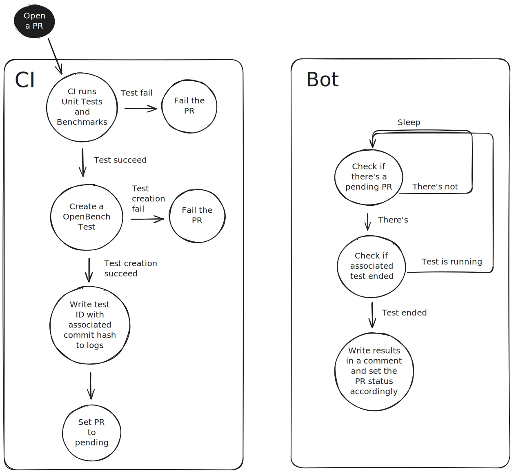
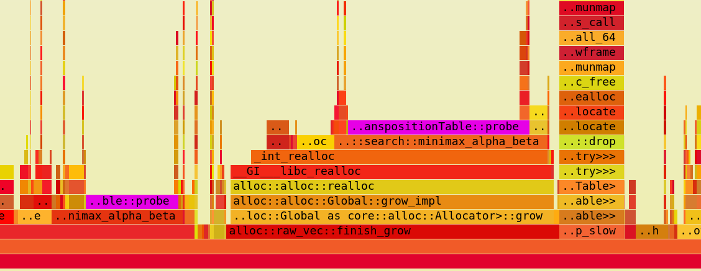
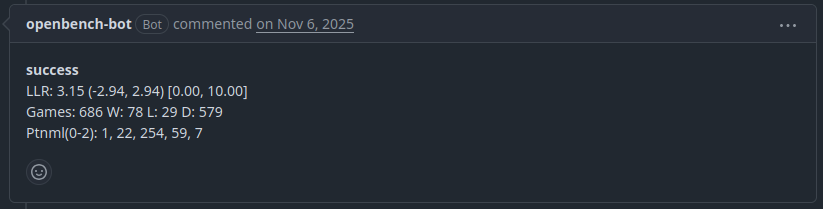

+++
title = 'Programa de Xadrez: Base de Testes'
date = 2025-09-28T18:07:18-03:00
draft = false
tags = [
    "Continuous Integration",
    "Transposition Table",
]
image = "banner.png"
+++

Neste post, detalho como automatizei os testes do meu programa de xadrez e por que minha primeira tentativa com as Tabelas de Transposição (Transposition Tables) deixou a minha engine 29 vezes mais lenta.

## Por que os Testes Importam

Precisamos de uma maneira de garantir que estamos constantemente melhorando a força da engine (seu ELO), garantindo que qualquer mudança no código realmente torne o programa melhor, não pior.

Eu já havia começado com alguns testes básicos, como testes unitários e testes perft que validam se os movimentos estão sendo gerados corretamente. Além disso, podemos fazer um benchmark do nosso código para verificar se ele está ficando mais rápido ou mais lento. Em Rust, existem vários crates para benchmarking. Eu escolhi o **Divan** para analisar a velocidade do código.

As FENs abaixo testam o gerador de movimentos em diferentes fases do jogo: a posição inicial, um meio-jogo complexo e um final de jogo simplificado.

```Rust
#[divan::bench(
	args = [
		("rnbqkbnr/pppppppp/8/8/8/8/PPPPPPPP/RNBQKBNR w KQkq - 0 1"),
		("rnbqkbnr/pppppppp/8/8/8/8/PPPPPPPP/RNBQKBNR b KQkq - 0 1"),
		("r3k2r/p1ppqpb1/bn2pnp1/3PN3/1p2P3/2N2Q1p/PPPBBPPP/R3K2R w KQkq - 0 1"),
		("r3k2r/p1ppqpb1/bn2pnp1/3PN3/1p2P3/2N2Q1p/PPPBBPPP/R3K2R b KQkq - 0 1"),
		("8/2p5/3p4/KP5r/1R3p1k/8/4P1P1/8 w - - 0 1"),
		("8/2p5/3p4/KP5r/1R3p1k/8/4P1P1/8 b - - 0 1"),
		("rnbqkbnr/pp1ppppp/8/2p5/4P3/8/PPPP1PPP/RNBQKBNR w KQkq c6 0 1"),
		("rnbqkbnr/pp1ppppp/8/2p5/4P3/8/PPPP1PPP/RNBQKBNR b KQkq c6 0 1")
	],
)]

fn generate_moves(bencher: Bencher, fen: &str) {
	let mut game = GameState::default();
	game.set_fen_position(fen);
	
	bencher.bench_local(|| {
		game.generate_moves();
	});
}

```

Este teste cronometra o gerador de movimentos em diferentes posições. Aqui está a saída — nosso ponto de partida (baseline) do benchmark:

| position                                                             | fastest  | slowest  | median   | mean     | samples | iter |
| -------------------------------------------------------------------- | -------- | -------- | -------- | -------- | ------- | ---- |
| 8/2p5/3p4/KP5r/1R3p1k/8/4P1P1/8 w - - 0 1                            | 1.613 ms | 1.717 ms | 1.635 ms | 1.641 ms | 100     | 100  |
| r3k2r/p1ppqpb1/bn2pnp1/3PN3/1p2P3/2N2Q1p/PPPBBPPP/R3K2R w KQkq - 0 1 | 239.6 ms | 243.3 ms | 241.9 ms | 241.9 ms | 100     | 100  |
| rnbqkbnr/pp1ppppp/8/2p5/4P3/8/PPPP1PPP/RNBQKBNR w KQkq c6 0 1        | 12.01 ms | 12.6 ms  | 12.09 ms | 12.11 ms | 100     | 100  |
| rnbqkbnr/pppppppp/8/8/8/8/PPPPPPPP/RNBQKBNR w KQkq - 0 1             | 6.359 ms | 7.409 ms | 6.42 ms  | 6.44 ms  | 100     | 100  |

## Teste de Razão de Probabilidade Sequencial (SPRT)

Para medir de verdade se o ELO da engine está melhorando, é necessário um tipo diferente de teste: o **Sequential Probability Ratio Test (SPRT)**. A ideia é colocar duas versões da engine para se enfrentarem — a versão antiga e a nova. Se a nova versão vencer mais partidas, a mudança teve um efeito positivo no ELO. Se perder mais, o efeito foi negativo.

Existem algumas ferramentas que podem executar um SPRT, sendo o `cutechess` e o `fastchess` as mais conhecidas. Deixo aqui como se pode executar um SPRT com o `cutechess`:

```
cutechess-cli \
-engine cmd=/path/to/old_engine name="Old Engine" \
-engine cmd=./path/to/new_engine name="New Engine" \
option.Threads=1 -each proto=uci tc=40/60 -rounds 20000 \
-sprt elo0=0 elo1=10 alpha=0.05 beta=0.05 \
-pgnout ./sprt.pgn -ratinginterval 50 -concurrency 4
```

Este comando testa se a nova engine é pelo menos 10 ELO mais forte, com uma chance de 5% de falso positivo ou falso negativo e um número máximo de 20.000 partidas, mas o teste termina mais cedo se um resultado conclusivo for alcançado antes disso.

Isso parece fácil, mas é tedioso — temos que rodar esse teste toda vez que implementamos um novo recurso ou otimização para garantir que a mudança teve o efeito desejado. E, mais cedo ou mais tarde, um código incorreto vai passar devido ao trabalho manual envolvido. É por isso que o teste automatizado é necessário.

> "Você não sobe ao nível das suas metas, você cai ao nível dos seus sistemas" - James Clear

## O Desafio da Automação

Um pipeline simples de Integração Contínua (CI) precisaria:

1. Baixar o cutechess
2. Obter a versão atual da engine
3. Obter a versão proposta da engine
4. Executar o teste SPRT
5. Verificar se a modificação melhorou, piorou ou manteve o ELO da engine o mesmo.

Eu poderia rodar essa automação diretamente no GitHub CI, mas os testes podem demorar muito para ter um resultado conclusivo, e o GitHub tem limites mensais de minutos de CI. Por isso, precisei de outra maneira para automatizar esses testes mais longos.

Pesquisando, encontrei infraestruturas que já implementam esse tipo de teste: OpenBench e FishTest, para citar algumas. Elas rodam partidas de forma descentralizada — o que significa que várias máquinas podem testar o programa em momentos diferentes, e os testes podem rodar em máquinas diferentes daquela que utilizo para o desenvolvimento. No futuro, eu poderia dedicar um Raspberry Pi ou outro dispositivo para testar minha engine, por exemplo.

Para utilizar o OpenBench no estágio atual da minha implementação, precisei adicionar os requisitos básicos:

> - **Opção UCI para `Hash` e para `Threads`**: Se sua engine não suporta multi-threading, você pode retornar `option name Threads type spin default 1 min 1 max 1` na inicialização do UCI. O mesmo pode ser feito para o `Hash`.
> - **Todas as engines devem ser compiláveis executando um makefile**: Engines escritas em linguagens diferentes de C/C++ ainda são compiladas executando um comando make, embora o makefile possa ser tão simples quanto executar o `cargo` e passar uma ou duas opções.
> - **Todos os makefiles da engine devem suportar a passagem de EXE= para controlar o nome do binário de saída**: O OpenBench executará `make EXE=Engine-ABCDEFGH`. É crítico que o arquivo de saída seja de fato nomeado `Engine-ABCDEFGH`, ou `Engine-ABCDEFGH.exe` no mesmo diretório do makefile.
> - **Todas as engines devem suportar a execução de "bench" via linha de comando**: Isso deve relatar uma contagem final de nós (nodes) e uma contagem final de nós por segundo (nps) e, em seguida, encerrar. Um formato simples e aceitável é `4712710 nodes 1323423 nps`. Consulte a função `parse_bench_output()` em `Client/bench.py` para detalhes específicos.

Depois de adicionar os requisitos para suportar minha engine no OpenBench, é assim que a integração idealmente funcionaria:

1. Abrir um Pull Request (PR) no GitHub
2. O pipeline de Integração Contínua (CI) cria um novo teste no OpenBench
3. O PR é marcado como "pendente"
4. Quando o teste termina, o OpenBench sinaliza ao GitHub, e o status do PR é atualizado para "sucesso" ou "falha"

Infelizmente, o OpenBench não possui webhooks ou APIs que se integrem diretamente com o repositório do GitHub ou sistemas de CI. Então, tive que fazer um trabalho extra para colocar essa CI para funcionar.
## Implementando a CI de Teste

Primeiro, precisei replicar o que a página web do OpenBench faz ao criar um novo teste. Escrevi um script em Python para isso — usando o debug do navegador para capturar as requisições HTTP corretas. A CI invoca esse script para criar um novo teste com a branch de linha de base e a branch proposta.

Como executo minha instância do OpenBench localmente, usei um runner auto-hospedado (self-hosted runner) do GitHub para criar os testes na minha máquina. Se minha instância do OpenBench estivesse na web, isso não seria necessário — a CI do GitHub poderia criar o teste diretamente. Quando um teste é criado com sucesso, o hash do commit e o ID do teste são gravados nos logs da CI, e o PR é marcado como pendente.

Assim, em vez de um humano verificar os resultados dos testes, um bot faz isso. O bot verifica periodicamente se há PRs abertos no GitHub. Quando encontra um, ele olha os logs da CI em busca de um ID de teste e verifica se aquele teste específico foi concluído. Se o teste terminou, o bot posta um comentário com os resultados e aprova ou rejeita o PR.

Para dar ao bot acesso aos meus PRs e logs da CI, tive que criar um GitHub App com permissões específicas de leitura e de comentário. Com o ID desse App, escrevi um script em Python que:

- Verifica se há PRs marcados como "pendentes" por um teste do OpenBench
- Lê os logs de execução da CI para descobrir se um teste foi criado para aquele PR
- Consulta (poll) o OpenBench até que o teste termine
- Atualiza o status do commit para "sucesso" ou "falha" com base no resultado do teste

São várias partes, por isso aqui está um diagrama mostrando as etapas:




Agora, eu precisava de uma versão melhorada do meu programa de xadrez para testar a CI. Decidi começar implementando tabelas de transposição e ordenação de movimentos.
## Tabelas de Transposição (Transposition Tables)

As tabelas de transposição são uma forma de lembrar o que já foi pesquisado anteriormente; elas funcionam como um cache, armazenando posições do tabuleiro já analisadas para economizar tempo. Representamos a posição do tabuleiro como um número (hash) usando o algoritmo Zobrist e, em seguida, usamos esse número como um índice na tabela para verificar se já nos deparamos com essa posição antes durante a busca.

### Zobrist Hash

Em teoria, poderíamos usar qualquer algoritmo de hashing para codificar uma posição. No entanto, o algoritmo deve ser extremamente rápido para evitar adicionar um overhead significativo durante a busca na árvore. Um algoritmo de hashing sob medida para engines de xadrez é o Zobrist. Ele funciona gerando valores aleatórios para cada tipo de peça e cor em cada casa, além do lado a jogar, direitos de roque e colunas de captura en passant — basicamente, informações que identificam uma posição de forma única. Depois, ele aplica uma operação XOR entre todas elas.

Inicializamos o tabuleiro gerando valores aleatórios para:

1. Cada tipo de peça e cor em cada casa (64 casas × 12 tipos de peças)
2. Direitos de roque (ala do rei/ala da dama para brancas/pretas — 4 no total)
3. Lado a jogar (brancas ou pretas)
4. Colunas en passant (8 colunas possíveis)

Isso não foi fácil de entender quando implementei, então aqui está um exemplo de código que inicializa esses valores:
``` rust
impl Zobrist {
    /// Generates a new Zobrist structure with cryptographically secure random numbers.
    ///
    /// This should be called once and shared across all board instances for consistency.
    /// Uses `rand::rng()` for random number generation.
    ///
    /// # Performance
    /// - Initialization is O(64×12) = 768 random number generations
    /// - Should be done once at program start
    pub fn new() -> Self {
        let mut rng = rand::rng();
        let mut zobrist = Zobrist {
            pieces: [[0; 12]; 64],
            side_to_move: rng.random(),
            castling_rights: [rng.random(), rng.random(), rng.random(), rng.random()],
            en_passant: [
                rng.random(),
                rng.random(),
                rng.random(),
                rng.random(),
                rng.random(),
                rng.random(),
                rng.random(),
                rng.random(),
            ],
        };

        for square in 0..64 {
            for piece in 0..12 {
                zobrist.pieces[square][piece] = rng.random();
            }
        }
        zobrist
    }
}
```

Ao fazer um movimento, aplicamos um XOR para remover a peça da casa anterior e outro XOR para colocá-la na nova casa. Também aplicamos um XOR no lado a jogar — isso torna a posição única para a cor de quem é a vez. Para gerar um novo hash ou desfazer um, precisamos (na maioria dos casos) de apenas 3 operações XOR. Isso é extremamente eficiente.

O XOR é perfeito para este caso de uso porque é reversível: aplicar o XOR no mesmo valor duas vezes retorna o valor original. Isso significa que a mesma função que gera o hash de um movimento também pode desfazê-lo ao retroceder (undo) o movimento.
### Table Entry

Inicialmente, tentei usar uma `struct` para armazenar os dados de avaliação na tabela, mas percebi que o tamanho da struct limitaria a quantidade de entradas que a tabela poderia conter. Então, mudei para uma representação de 64 bits que compacta todas as informações de avaliação em um único número inteiro:

```
MSB (Bit Mais Significativo)                                LSB (Bit Menos Significativo)
  63         50 49      42 41              26 25 24 23     16 15                0
 +-------------+----------+------------------+-----+---------+------------------+
 |  Reservado  |  Idade   |   Melhor Lance   |Tipo |Profundid|    Pontuação     |
 |  (14 bits)  | (8 bits) |    (16 bits)     |(2b) | (8 bits)|    (16 bits)     |
 +-------------+----------+------------------+-----+---------+------------------+
        |            |               |          |       |          |
        |            |               |          |       |          +-- Pontuação (i16)
        |            |               |          |       +-- Profundidade (u8)
        |            |               |          +-- Tipo de Nó (Exato/Superior/Inferior)
        |            |               +-- Melhor Lance (Veja o detalhamento abaixo)
        |            +-- Idade da Entrada (para substituição)
        +-- Bits Não Utilizados
```

Escovar bits é propenso a erros e não escala, então escrevi funções auxiliares para obter e definir esses valores sem precisar lidar com manipulação de bits no código principal:
``` rust
impl TranspositionEntry {
	fn score(data: u64) -> i16 {
		((data & 0xFFFF) as u16) as i16
	}
	
	fn depth(data: u64) -> u8 {
        ((data >> 16) & 0xFF) as u8
    }
```

Ah, e o melhor movimento foi codificado em um formato de 16 bits:
```
15          12 11           6 5            0
 +-------------+---------------+--------------+
 |  Promoção   |   Casa Para   |  Casa De     |
 |  (4 bits)   |   (6 bits)    |   (6 bits)   |
 +-------------+---------------+--------------+
        |               |               |
        |               |               +-- 0-63 (ex: E2)
        |               +-- 0-63 (ex: E4)
        +-- Flags: Dama(0x1), Torre(0x2), Bispo(0x4), Cavalo(0x8)
```

Com essa codificação (8 bytes por entrada), uma tabela de 1 GB pode conter 134.217.728 posições. Pode parecer muito, mas no mundo do xadrez, não é tanto assim. Em pouco tempo, a tabela sofrerá colisões de hash, então precisaremos de uma estratégia de substituição para excluir as entradas antigas e manter as relevantes — algo para implementar corretamente no futuro. Mas por enquanto, um outro problema mais grave me chamou atenção.
### Condições de Corrida (Data Races)

Quando você tem um programa multi-threaded lendo e escrevendo na mesma tabela, pode encontrar condições de corrida — uma thread escrevendo enquanto outra lê. Isso pode levar a erros catastróficos (movimentos muito ruins ou inválidos). A solução mais comum é usar um mutex para impedir o acesso concorrente. Portanto, minha primeira tentativa de implementar a Tabela de Transposição (TT) usou `Arc<RwLock<T>>` — uma trava de leitura/escrita com contagem de referência atômica — para compartilhar a tabela entre várias threads e evitar a corrupção da tabela.

O benchmark do minimax com poda alfa-beta mais tabelas de transposição me deu o seguinte resultado:

| position                                                             | fastest  | slowest  | median   | mean     | samples | iter |
| -------------------------------------------------------------------- | -------- | -------- | -------- | -------- | ------- | ---- |
| 8/2p5/3p4/KP5r/1R3p1k/8/4P1P1/8 w - - 0 1                            | 178.1 ms | 196.4 ms | 179.7 ms | 180.8 ms | 100     | 100  |
| r3k2r/p1ppqpb1/bn2pnp1/3PN3/1p2P3/2N2Q1p/PPPBBPPP/R3K2R w KQkq - 0 1 | 538.2 ms | 563.4 ms | 540.7 ms | 541.6 ms | 100     | 100  |
| rnbqkbnr/pp1ppppp/8/2p5/4P3/8/PPPP1PPP/RNBQKBNR w KQkq c6 0 1        | 194.1 ms | 199.2 ms | 195.8 ms | 195.8 ms | 100     | 100  |
| rnbqkbnr/pppppppp/8/8/8/8/PPPPPPPP/RNBQKBNR w KQkq - 0 1             | 185.1 ms | 207.7 ms | 189 ms   | 190.4 ms | 100     | 100  |

**O resultado foi um desastre.** O engine ficou de 2 a 29 vezes mais lento:

| **Position**   | **Baseline (No TT)** | **With TT (RwLock)** | **Result**      |
| -------------- | -------------------- | -------------------- | --------------- |
| **Startpos**   | 6.42 ms              | 189 ms               | **29x Slower**  |
| **Middlegame** | 241.9 ms             | 540.7 ms             | **2.2x Slower** |

Usando **Flamegraphs**, encontrei o culpado: **Disputa de Trava (Lock Contention).** O algoritmo de busca estava gastando uma quantidade significativa de tempo apenas esperando por permissão para ler ou escrever na tabela. Mesmo em um ambiente de uma única thread, o overhead de gerenciar a trava estava destruindo o desempenho:



O problema é como as travas de leitura-escrita funcionam. O `RwLock` adiciona operações atômicas a cada verificação; como a busca tenta ler a tabela em cada posição, esse overhead se acumula e retarda o tempo de busca em vez de ajudar.

Como meu engine de xadrez possui apenas uma thread para a busca, eu poderia mudar para um `RefCell`, que é mais barato que o `RwLock`. Mas para construir um engine competitivo de ponta, o suporte a paralelismo é obrigatório. Não existe almoço grátis, mas talvez eu consiga algo mais barato com outra abordagem.

### Lockless Table

E se pudéssemos permitir leituras e escritas concorrentes sem usar travas? A solução é uma etapa de verificação que detecta se uma entrada foi corrompida por uma escrita simultânea.

Funciona assim: ao armazenar uma posição na tabela, não salvamos apenas o resultado da busca; também salvamos um _hash de verificação_ que prova que esta entrada pertence a esta posição específica. Esse hash de verificação é computado aplicando a operação XOR no hash Zobrist de 64 bits da posição com os dados de entrada de 64 bits (avaliação da posição) que estamos armazenando.

Ao ler da tabela mais tarde, revertemos o processo: pegamos a entrada armazenada, aplicamos o XOR com o hash Zobrist da posição atual e vemos se o resultado coincide com o hash de verificação armazenado. Se coincidirem, a entrada é válida e segura para uso. Se não coincidirem (porque outra thread sobrescreveu parte dela no meio da leitura), simplesmente ignoramos a entrada e recomputamos do zero.

Essa abordagem transforma uma condição de corrida de um travamento (crash) em um erro de cache (cache miss) inofensivo. Sem travas, sem espera, apenas uma operação XOR barata a cada acesso à tabela. A tabela agora armazena dois valores de 64 bits por entrada: os dados de avaliação e o hash de verificação.

Depois de mudar para a implementação sem travas, obtive os seguintes tempos:

| position                                                             | fastest   | slowest  | median   | mean     | samples | iter |
| -------------------------------------------------------------------- | --------- | -------- | -------- | -------- | ------- | ---- |
| 8/2p5/3p4/KP5r/1R3p1k/8/4P1P1/8 w - - 0 1                            | 6.632 us  | 14.26 ms | 15.36 us | 157.8 us | 100     | 100  |
| r3k2r/p1ppqpb1/bn2pnp1/3PN3/1p2P3/2N2Q1p/PPPBBPPP/R3K2R w KQkq - 0 1 | 14.66 us  | 245.4 ms | 17.1 us  | 2.472 ms | 100     | 100  |
| rnbqkbnr/pp1ppppp/8/2p5/4P3/8/PPPP1PPP/RNBQKBNR w KQkq c6 0 1        | 11.8 us   | 58.96 ms | 12.42 us | 602.1 us | 100     | 100  |
| rnbqkbnr/pppppppp/8/8/8/8/PPPPPPPP/RNBQKBNR w KQkq - 0 1             | 9.497  us | 29.23 ms | 10.05 us | 302.4 us | 100     | 100  |

O tempo mais rápido melhorou drasticamente — de uma a duas ordens de magnitude. No entanto, os tempos mais lentos pioraram. Isso mostra que, quando avaliamos uma posição pela primeira vez, adicionamos um overhead ao consultar a tabela. Mas quando encontramos a mesma posição novamente, aceleramos a avaliação massivamente.

| **Position**   | **Baseline** | **Lockless TT** |
| -------------- | ------------ | --------------- |
| **Startpos**   | 6.42 ms      | **10.05 us**    |
| **Middlegame** | 241.9 ms     | **17.1 us**     |
## Move Ordering

Se buscarmos os melhores lances primeiro, podemos podar (cortar) grandes partes da árvore de busca, acelerando a pesquisa massivamente. Mas como sabemos quais lances são mais promissores?

Por enquanto, estou mantendo as coisas simples. Minha ordenação de movimentos prioriza:

1. **O melhor lance da tabela de transposição** — se encontramos um lance vencedor nesta posição antes, vamos tentá-lo primeiro.
2. **Capturas** — capturar uma peça geralmente é melhor do que mover para um lugar qualquer.

É isso. Sem heurísticas killer, sem heurística de histórico, sem MVV-LVA (Most Valuable Victim - Least Valuable Aggressor) para ordenação de capturas. Apenas o lance da TT primeiro, depois todas as capturas, e então todo o resto.

Isso está longe de ser o ideal. Um esquema de ordenação de movimentos adequado classificaria as capturas pelo valor da peça capturada em relação à peça que se move, rastrearia movimentos killer que causam podas beta e manteria pontuações de histórico de lances ao longo da busca. Mas implementar isso é um projeto para outro dia.

Por enquanto, mesmo essa abordagem simples dá à busca uma chance de lutar — e é o suficiente para testar meu pipeline de CI. Voltarei às melhorias na ordenação de movimentos assim que a base estiver sólida.

## Resultados

Após implementar as tabelas de transposição e a ordenação de movimentos, a pergunta que fica é: realmente melhorou? Deixei meu bot responder a isso:



O engine venceu 78 partidas, perdeu 29 e empatou 579 de um total de 686 jogos. A Razão de Verossimilhança Logarítmica (LLR) confirma que a nova é de fato melhor que a versão anterior.

O programa de xadrez está oficialmente mais forte. E mais importante, agora tenho a base automatizada para garantir a melhoria contínua.
## Referências

- [Engine Testing Guide](https://dannyhammer.github.io/engine-testing-guide/sprt.html)
- [Lockless Table](https://talkchess.com/viewtopic.php?t=76483)